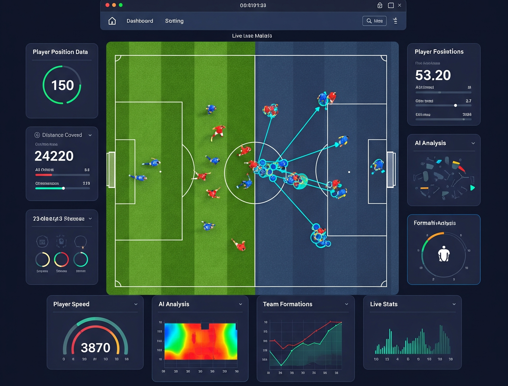

{width="600px" fig-align="center"}

::: {layout="[[1,1], [1]]" layout-valign="top"}

{width="400px" fig-align="center"}
:::

**DFG-Geschäftszeichen: EW 134/22-1**

Herzlich willkommen auf der Projekt-Website des Projekts SportVid, einem Forschungsprojekt der Technischen Informationsbibliothek (TIB) und der Deutschen Sporthochschule Köln (DSHS).

**SportVid** ist ein interdisziplinäres Forschungsprojekt mit dem Ziel, eine digitale Infrastruktur für Videoanalysen im Breiten- und Nachwuchssport zu entwickeln. Dabei steht die Ermöglichung niedrigschwelliger, datenschutzkonformer und pädagogisch sinnvoller Videonutzung im Zentrum.

## 🛠 Technologische Grundlage

Die Plattform nutzt aktuelle Verfahren aus der **Computer Vision**, um automatisiert Informationen aus Videoaufnahmen zu extrahieren. Dabei werden sowohl Basisalgorithmen eingesetzt, welche generische Merkmale der Videoaufnahmen erkennen, als auch spezialisierte Algorithmen, die sportspezifische Ereignisse detektieren oder sportspezifische Daten zu generieren.

------------------------------------------------------------------------

> **SportVid** wird gefördert durch die **Deutsche Forschungsgemeinschaft (DFG)** im Rahmen des Förderprogramms für **Wissenschaftliche Literaturversorgungs- und Informationssysteme (LIS)**

Weitere Informationen zum Projektfortschritt folgen auf dieser Seite in Kürze. Bei Interesse an künftigen Ergebnissen des Projekts freuen wir uns über Ihre Kontaktaufnahme!

<a href="mailto:its@dshs-koeln.de" class="btn btn-light" style="background-color: #00529B; color: #fff; border: none; margin-bottom: 1em; font-weight: 500;"> 📧 E-Mail schreiben </a>